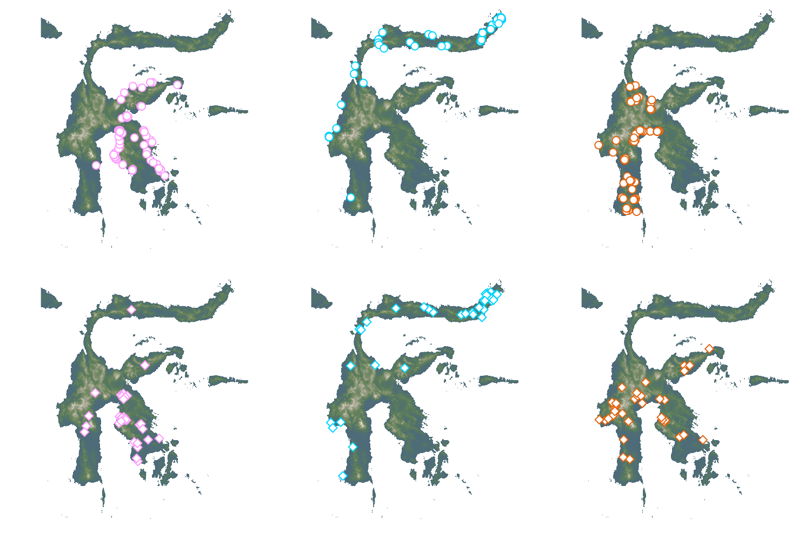

# Fauxcurrences.jl

***MAINTENANCE MODE*** - this repo is being move to a monorepo with better integration between features

This package is a *clean-room*, *feature-equivalent* re-write in Julia of most
of the functionalities of the [`fauxcurrence` package for R][paper]. The
original code is licensed under the GPL, and this package is licensed under the
MIT. For this reason, the original code, and any document distributed with it,
has not been consulted during the implementation; the work is entirely based on
the published article. As detailed in the following sections, the two packages
do not have *feature parity*, but there is an overlap in the most significant
functions.

[paper]: https://onlinelibrary.wiley.com/doi/full/10.1111/ecog.05880

The citation for the original `fauxcurrence` paper is

> Osborne, O. G., Fell, H. G., Atkins, H., van Tol, J., Phillips, D.,
> Herrera‐Alsina, L., Mynard, P., Bocedi, G., Gubry‐Rangin, C., Lancaster, L.
> T., Creer, S., Nangoy, M., Fahri, F., Lupiyaningdyah, P., Sudiana, I. M.,
> Juliandi, B., Travis, J. M. J., Papadopulos, A. S. T., & Algar, A. C. (2022).
> Fauxcurrence: Simulating multi‐species occurrences for null models in species
> distribution modelling and biogeography. Ecography.
> https://doi.org/10.1111/ecog.05880

## Statement of need

This package allows to rapidly (and in a memory-efficient) way generate
simulated occurrence data that have the same statistical properties as empirical
datasets. It has been expanded to allow users to fine-tune the pairwise
dependencies of species distributions on one another. This packages allows to
generate synthetic datasets that can be used as either null models, or as
benchmark data to evaluate methods to work with point occurrence data.

## Installation instructions

The stabe release of the package is available from the Julia general registry,
and can be installed with `]add Fauxcurrences`. The development branch can be
checked out with `]add Fauxcurrences#main`.

## Example usage

There is an [online documentation][doc] for the `Fauxcurrences.jl` package, also
available as a Jupyter [notebook][nb]. The documentation is a full-run of the
package functions, which also serves as an integration test. The methods are all
documented using the usual Julia docstrings, accessible at the REPL.

[doc]: https://docs.ecojulia.org/Fauxcurrences.jl/
[nb]: https://docs.ecojulia.org/Fauxcurrences.jl/fauxcurrences_demo.ipynb

## Community guidelines

Contributions are welcome through issues or pull requests.

## Why a re-implementation?

Interoperability: this package uses `SimpleSDMLayers`, `Distances`, and `GBIF`
as backends, making it fit very snuggly with the rest of the (Eco)Julia
ecosystem, and working towards integration of tools to build SDMs at scale.

Expandability: the package is built on modular functions, to ensure that custom
workflows can be built, while maintaining a general interface.

Performance: by relying on pre-allocated matrices, the operations are fairly
fast. Whenever a point changes, only the matrices that are impacted are updated,
which results in notable improvements for more taxa.

Licensing: the package uses the more permissive MIT license, imposing fewer
<<<<<<< HEAD
constraints on contributors.
=======
constraints on contributors.
>>>>>>> Fauxcurrences/main
