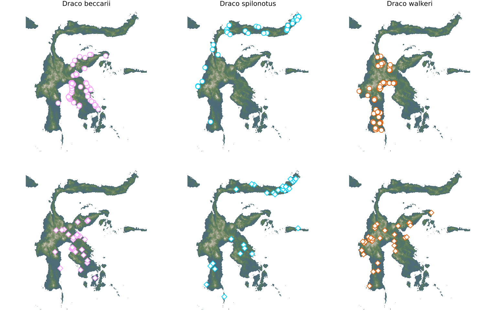

# Fauxcurrences.jl

This package is a *clean-room*, *feature-equivalent* re-write in Julia of most
of the functionalities of the [`fauxcurrence` package for R][paper]. The
original code is licensed under the GPL, and this package is licensed under the
MIT. For this reason, the original code, and any document distributed with it,
has not been consulted during the implementation; the work is entirely based on
the published article. As detailed in the following sections, the two packages
do not have *feature parity*, but there is an overlap in the most significant
functions.

[paper]: https://onlinelibrary.wiley.com/doi/full/10.1111/ecog.05880

## Why?

Interoperability: this package uses `SimpleSDMLayers`, `Distances`, and `GBIF`
as backends, making it fit very snuggly with the rest of the (Eco)Julia
ecosystem, and working towards integration of tools to build SDMs at scale.

Expandability: the package is built on modular functions, to ensure that custom
workflows can be built, while maintaining a general interface.

Performance: by relying on pre-allocated matrices, the operations are fairly
fast. Whenever a point changes, only the matrices that are impacted are updated,
which results in notable improvements for more taxa.

Licensing: the package uses the more permissive MIT license, imposing fewer
constraints on contributors.

## Overview of methods

Note that *none* of the methods are exported, so they need to be called with
`Fauxcurrences.method_name`. These methods are the ones that users will need to
call to set-up a whole run of the pipeline.

| method                             | description                                                  |
| ---------------------------------- | ------------------------------------------------------------ |
| `get_valid_coordinates`            | transforms GBIF observations to a matrix of coordinates      |
| `preallocate_distance_matrices`    | prepares the matrices for the intra/inter-specific distances |
| `measure_intraspecific_distances!` | updates the intra-specific distances                         |
| `measure_interspecific_distances!` | updates the inter-specific distances                         |
| `preallocate_simulated_points`     | prepare the matrix for the coordinates of simulated points   |
| `bootstrap!`                       | generates the initial proposition for the null               |
| `score_distributions`              | measures the distribution distance                           |

## Suspected and know changes to the original package

The changes are classified by whether or not we **KNOW** or **SUSPECT** a
change, and further by whether the change is a **difference** (the two packages
do things differently), a **removal** (features from `fauxcurrence` have not
been ported), or an **addition** (`Fauxcurrences.jl` has unique features).

**KNOWN/difference** The distance between distribution is measured using the square
root of the ranged Jensen-Shannon divergence (the original package uses the
Kullback-Leibler divergence) - this measure gives a value in 0-1 *and* is a true
metric. The JS distance is symmetrical for any two distributions, but more
importantly, never returns an infinite value when one density is 0 and the other
is not. For sparse datasets and/or clumped occurrences, this means that JS will
return a value that can still be compared by the optimizer. Note also that for a
JS distance of x, the equivalent KL divergence would be of the order of x².

**KNOWN/addition** The number of points to simulate can be fixed *per species* -
this is important because we may want to benchmark algorithms under the
unrealistic assumption that the sampling effort is the same.

**KNOWN/removal** The bootstrap phase (generation of the initial null) picks
distances from the distance matrix, rather than performing an estimation of the
underlying distribution. This is mostly because the points will be refined
anyways, so the faster solution was selected.

**SUSPECTED/difference** The constraints on simulated points are as follow: the
intra-specific distance cannot be larger than the observed intra-specific
distance, and the inter-specific distance cannot be larger than the observed
pairwise inter-specific distance. This is motivated by two reasons. First, this
makes the binning of the distributions a lot more stable, as the upport bound of
the distribution remains the same. Second, this ensures that the optimizer does
not "cheat" by over-expanding the simulated points.

**SUSPECTED/difference** During optimization, the *only* criteria that is
checked is that the average of all divergences (intra-specific and pairwise
inter-specific) must decrease; this can result in *increases* of the distance
for one or more of the component distributions. There is no indication in the
original manuscript of what constitutes an acceptable move, and the clean-room
re-implementation means that the code was not consulted.

**KNOWN/removal** `Fauxcurrences.jl` does not offer non-pairwsie inter-specific
distances. This is a direct consequence of the next point, which is one of the
most significant additions to the package.

**KNOWN/addition** `Fauxcurrences.jl` offers the ability to weigh the different
matrices (intra v. inter). In the default configuration, all *matrices* have the
same weight. An alternative calibration scheme is to give an equivalent weight
to the sum of the *n* intra-specific matrices, and of the *n(n-1)/2*
inter-specific matrices. Additional calibrations can reflect other biological
constraints. This addition is important because in the case of multiple species,
the pairwise inter-specific distances can rapidly dominate the overall score.
The ability to set a weight matrix can lead to, for example, starting the null
model with only the intra-specific matrices, and then optimizing the
inter-specific matrices.

**KNOWN/difference** `Faucurrences.jl` does not generate distribution of *raster
cells*, and is focused on *observations*. This has been motivated by our
use-cases where rasters can have different spatial resolutions. Generating
occurrences is a little bit more computationallig expensive, but the memory
footprint has been optimized.

**KNOWN/difference** By default, `Fauxcurrences.jl` uses the Haversine distance
for both the evaluation of distance matrices and the generation of new points.
This decision was taken because (i) the Haversine distance is probably a good
enough approximation given the possible measurement error, sampling biases, and
raster resolution, and (ii) the first geodetic problem can be solved in a very
computationally efficient way for this distance, speeding up the generation of
new points significantly.